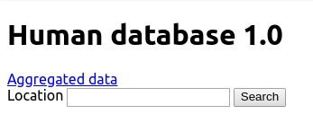
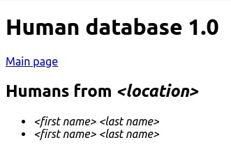
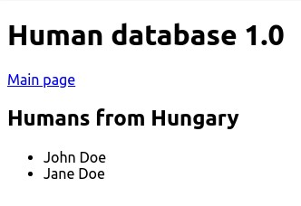
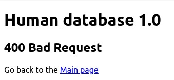
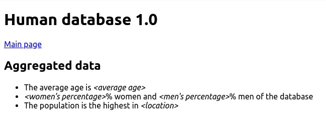
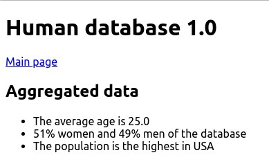

# Human database 1.0

## Endpoints

### GET `/`

- It should display the main page

- The main page should display

  - the heading
  - the link to the GET `/humans/aggregate` page
  - the form with a text field and a submit button

- The form should not allow submission with empty text field

- After the form is submitted it should go to GET `/humans` with the requested
  location

- The main page

  

### GET `/humans?location=<location>`

- It should display the `filter by location` page

- The filter by location page should display

  - the heading
  - the link to the GET `/` page
  - the heading with the location
  - the humans' first and last name with the specific location if there is any

- If the location is not present or empty display the bad request page

- The bad request page should display

  - the two headings
  - link back to the GET `/` page

Example query:

```raw
GET /humans?location=Hungary
```

It should display all the humans from Hungary

- The filter page with abstract values

  

- The filter page with actual values

  

- The bad request page

  

### GET `/humans/aggregate`

- It should display the aggregation page

- The aggregation page should display

  - the two headings
  - the link to the GET `/` page
  - the average age
  - the gender ratio in percentage
  - the location with the most human

- If there is no human in the database redirect to the GET `/` page

- The aggregation page with abstract values

  

- The aggregation page with actual values

  

### POST `/api/humans`

- It should be a REST endpoint

- It should accept the following key-value pairs in JSON format

  - `firstName` : string
  - `lastName` : string
  - `age` : number
  - `gender` : string
  - `location` : string
  
  Example:

  ```json
  {
    "firstName": "John",
    "lastName": "Doe",
    "age": 29,
    "gender": "man",
    "location": "USA"
  }
  ```

- It should validate the request body

  - All properties should be present
  - Age should be a number
  - Gender should be `man` or `woman`
  - First name, last name, gender and location are strings

- If the validation fails it should respond with `400 Bad Request`

- If the validation passes it should store the entity in the database and
  respond with `201 Created`

## Question

Given the following table named `applicants`.

| id | name               | country_id | age |
|:---|:-------------------|:-----------|:----|
| 1  | Bořivoj Souček     | 1          | 24  |
| 2  | Papp Patrícia      | 2          | 33  |
| 3  | Kocsis Ivett       | 2          | 37  |
| 4  | Slavomír Vykukal   | 1          | 20  |
| 5  | Bruno Malík        | 1          | 31  |
| 6  | Veronika Lukešová  | 1          | 18  |
| 7  | Székely Miklós     | 2          | 29  |
| 8  | Hegedüs Benjámin   | 2          | 37  |
| 9  | Nela Machová       | 1          | 20  |
| 10 | Balog Rajmund      | 2          | 39  |
| 11 | Major Borbála      | 2          | 35  |
| 12 | Evelína Horváthová | 1          | 23  |
| 13 | Vászoly Vivien     | 2          | 40  |
| 14 | Lada Stýskalová    | 1          | 27  |
| 15 | Dagmar Benešová    | 1          | 33  |

Given the following table named `countries`.

| id | country        |
|:---|:---------------|
| 1  | Czech Republic |
| 2  | Hungary        |

Write an SQL query to select the name and the country of applicants from
Hungary with the age 40.

The expected result should be the following.

| name           | country |
|:---------------|:--------|
| Vászoly Vivien | Hungary |
