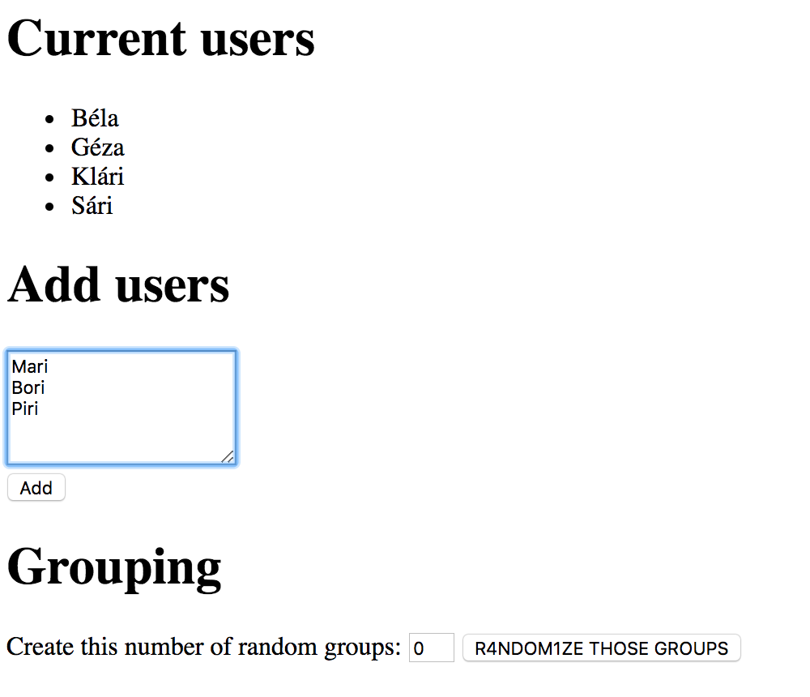
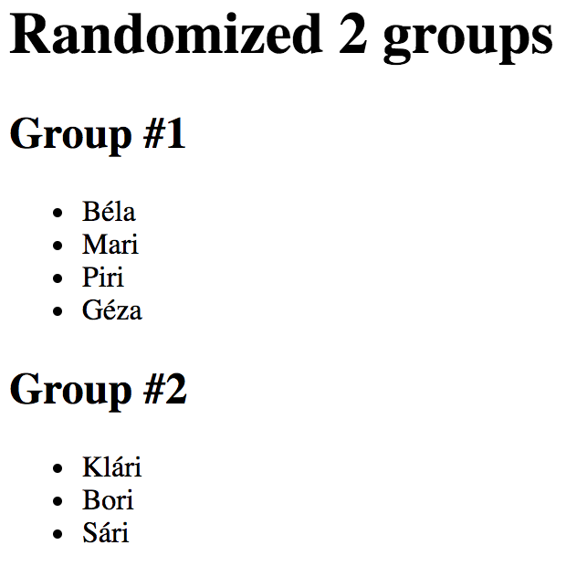

# Random Group Generator

Build a webapp that people can use to create random groups of people

## Highlights

- It has a frontend which can:

  - list current users
  - add multiple new users as bulk
  - sort the users into specific number of groups

## Endpoints

### GET `/`

This endpoint should render the main page:



- the **main frontend** should have 3 sections

  - current users

    - heading
    - unordered list of users

  - add users

    - heading
    - form with a textarea and a submit button

  - grouping

    - heading
    - input for number of groups to be created
    - submit button

### GET `/api/list`

This endpoint should list all users saved in the database:

```json
{
    "users": [
        {
            "id": 1,
            "name": "Béla"
        },
        {
            "id": 2,
            "name": "Klári"
        },
        ...
    ]
}
```

### POST `/api/add`

This endpoint should

- split the textarea's content by the line separator
- save a new user for each line in the database
- it should send back the saved users' count as result:

```json
{
    "saved": 3
}
```

- the frontend should append the saved users to the existing unordered list

### GET `/api/group`

This endpoint should

- split randomly the existing users in the database into the specified number
  of groups coming from the form (**you don't have to store the groups in the
  database, just send them as response**):

Example query:

`http://localhost:8080/api/group?count=3`

- this should return a json with every users in 3 groups

- the users should be divided as equally into the groups as possible 
  (*e.g. for 9 user into 3 groups should be 3-3-3 users*)

```json
{
    "count": 3,
    "groups": [
        [
            {
                "id": 3,
                "name": "Sári"
            },
            {
                "id": 1,
                "name": "Béla"
            },
            {
                "id": 4,
                "name": "Piri"
            }
        ],
        [
            {
                "id": 6,
                "name": "Bori"
            },
            {
                "id": 5,
                "name": "Mari"
            }
        ],
        [
            {
                "id": 2,
                "name": "Klári"
            },
            {
                "id": 7,
                "name": "Géza"
            }
        ]
    ]
}
```

The frontend should add a new section after the existing ones with the following
content:



It should contain

- a header with the group count
- group headers with the group index and names

## Question

You are working with following SQL table of 10 outstanding videogames:

| id | name                     | genre      | releaseDate | developer              | engine            | price | rating |
|---:|:-------------------------|:-----------|------------:|:-----------------------|:------------------|------:|-------:|
|  1 | The Witcher 3: Wild Hunt | RPG        |  2015-05-19 | CD Projekt Red         | REDengine 3       |  1499 |    9.2 |
|  2 | Half-Life 2              | FPS        |  2004-11-16 | Valve                  | Source            |   299 |    8.7 |
|  3 | The Sims                 | Simulation |  2000-01-31 | Maxis                  | Custom            |   199 |      9 |
|  4 | BioShock                 | FPS        |  2007-08-21 | 2K                     | Unreal Engine 2.5 |   350 |    9.1 |
|  5 | BioShock: Infinite       | FPS        |  2013-03-26 | Irrational Games       | Unreal Engine 3   |   699 |    8.4 |
|  6 | Quake                    | FPS        |  1996-07-22 | id Software            | Quake engine      |   299 |    8.6 |
|  7 | Diablo                   | RPG        |  1996-12-31 | Blizzard North         | DEngine           |   299 |    8.9 |
|  8 | World of Warcraft        | MMORPG     |  2004-11-23 | Blizzard Entertainment | Custom            |   499 |    8.8 |
|  9 | Grand Theft Auto V       | Advenure   |  2013-09-17 | Rockstar North         | RAGE              |   899 |    8.8 |
| 10 | Undertake                | Roleplay   |  2015-09-15 | Toby Fox               | GameMaker Studio  |   399 |    9.1 |

`1.` Write SQL query that will return top 2 rated FPS game's 
titles and developers.

`2.` Write SQL query that will make every game released in 20th century 
go on sale (reduce its price by 200).
