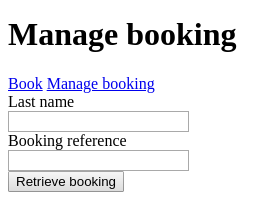

# Book a flight

## GET `/`

The following page must be rendered.


- All fields must be filled
- The form must be submitted to POST `/api/booking`
- The links must navigate between the two pages

Upon a successful submission display the following text under the form:

`Successful booking. Your booking reference is UERLAQ.`

Upon an unsuccessful submission display a descriptive message under the form.

## GET `/manage-booking`

The following page must be rendered.



- All fields must be filled
- The form must be submitted to GET `/api/booking`
- The links must navigate between the two pages

Upon a successful submission display the following under the form:

```raw
First name: Craig
Last name: Green
Passport number: BD0002028
```

Upon an unsuccessful submission display the descriptive message under the form.

## POST `/api/booking`

This endpoint is responsible to generate the booking reference and to store the booking in the database. The booking
reference is 6 characters long string, in which the characters are random.

The booking is not successful due to the following reasons:

- The same passport number cannot be used twice
- All fields must have a value

If the booking was successful the response must have **201 Created** status code with the booking reference in the
response body in the following format:

```json
{
  "bookingReference": "UERLAQ"
}
```

Otherwise it must have **400 Bad Request** and the descriptive message in the response body in the following format:

```json
{
  "message": "passport number already used"
}
```

## GET `/booking`

This endpoint is responsible to retrieve the booking information. It must receive the input from the query parameters.

If there is a matching entry in the database with the provided last name and booking reference then the response must
contain the following information:

```json
{
  "firstName": "Craig",
  "lastName": "Green",
  "passportNumber": "BD0002028"
}
```

If there is no matching entry in the database then response with a descriptive message.

## Question

You are working with following SQL table of 10 outstanding videogames:

| id | name                     | genre      | releaseDate | developer              | engine            | price | rating |
|---:|:-------------------------|:-----------|------------:|:-----------------------|:------------------|------:|-------:|
|  1 | The Witcher 3: Wild Hunt | RPG        |  2015-05-19 | CD Projekt Red         | REDengine 3       |  1499 |    9.2 |
|  2 | Half-Life 2              | FPS        |  2004-11-16 | Valve                  | Source            |   299 |    8.7 |
|  3 | The Sims                 | Simulation |  2000-01-31 | Maxis                  | Custom            |   199 |      9 |
|  4 | BioShock                 | FPS        |  2007-08-21 | 2K                     | Unreal Engine 2.5 |   350 |    9.1 |
|  5 | BioShock: Infinite       | FPS        |  2013-03-26 | Irrational Games       | Unreal Engine 3   |   699 |    8.4 |
|  6 | Quake                    | FPS        |  1996-07-22 | id Software            | Quake engine      |   299 |    8.6 |
|  7 | Diablo                   | RPG        |  1996-12-31 | Blizzard North         | DEngine           |   299 |    8.9 |
|  8 | World of Warcraft        | MMORPG     |  2004-11-23 | Blizzard Entertainment | Custom            |   499 |    8.8 |
|  9 | Grand Theft Auto V       | Advenure   |  2013-09-17 | Rockstar North         | RAGE              |   899 |    8.8 |
| 10 | Undertake                | Roleplay   |  2015-09-15 | Toby Fox               | GameMaker Studio  |   399 |    9.1 |

`1.` Write SQL query that will return top 2 rated FPS game's titles and developers.

`2.` Write SQL query that will make every game released in 20th century go on sale (reduce its price by 200).
